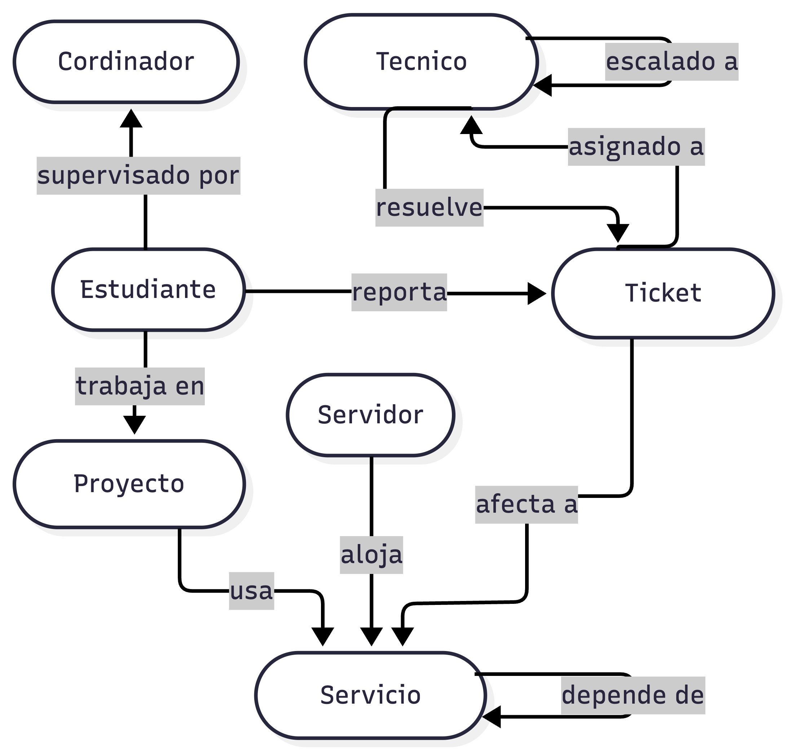

# Modelo del Grafo — Infraestructura IA Universitaria

## Tipos de Nodo

| Etiqueta       | Propiedades                      | Ejemplos                 |
| -------------- | -------------------------------- | ------------------------ |
| `:Servidor`    | nombre, tipo, ip                 | H200, A100, DGX          |
| `:Servicio`    | nombre, tipo, estado             | VPN, JupyterHub, Ollama  |
| `:Proyecto`    | nombre, tipo                     | Kapak, Pipeline NLP      |
| `:Estudiante`  | nombre, tipo, email              | Ana García, Luis Morales |
| `:Tecnico`     | nombre, nivel                    | Roberto Méndez (Dev)     |
| `:Ticket`      | id, estado, prioridad, categoria | TK-101 … TK-115          |
| `:Coordinador` | nombre, carrera                  | Daniel Riofrío           |

## Tipos de Relación

| Relación           | Desde → Hasta            | Propiedades      |
| ------------------ | ------------------------ | ---------------- |
| `:ALOJA`           | Servidor → Servicio      | —                |
| `:DEPENDE_DE`      | Servicio → Servicio      | —                |
| `:USA`             | Proyecto → Servicio      | —                |
| `:TRABAJA_EN`      | Estudiante → Proyecto    | —                |
| `:SUPERVISADO_POR` | Estudiante → Coordinador | —                |
| `:REPORTÓ`         | Estudiante → Ticket      | fecha            |
| `:AFECTA`          | Ticket → Servicio        | —                |
| `:ASIGNADO_A`      | Ticket → Tecnico         | fecha_asignacion |
| `:RESUELVE`        | Tecnico → Ticket         | fecha_resolucion |
| `:ESCALADO_A`      | Tecnico → Tecnico        | motivo           |

## Diagrama

## Pregunta central

Si cae el servidor H200, ¿qué servicios dejan de funcionar, qué proyectos quedan bloqueados y a qué estudiantes con tickets activos impacta?

Recorrido: `H200 → ALOJA → Servicio → USA ← Proyecto ← TRABAJA_EN ← Estudiante → REPORTÓ → Ticket`
