# Resultados y Evidencias

- Neo4j Browser (`http://localhost:7474`) con visualización del grafo
- Neo4j Desktop con las consultas OP-1 a OP-6 ejecutadas

### Grafico del grafo cargado en Neo4j Browser

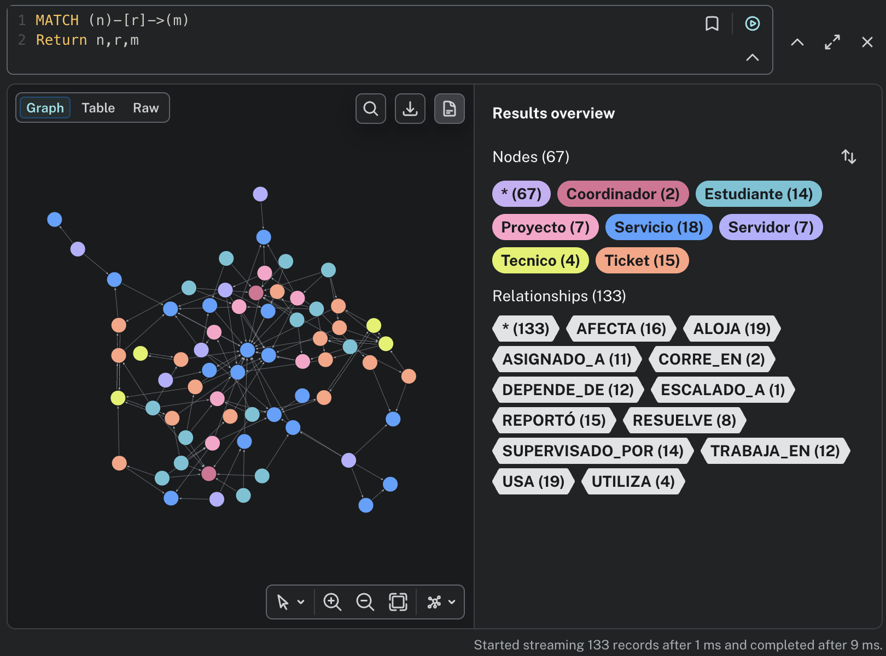

### Evidencias de la Operación 1

Contar nodos por etiqueta

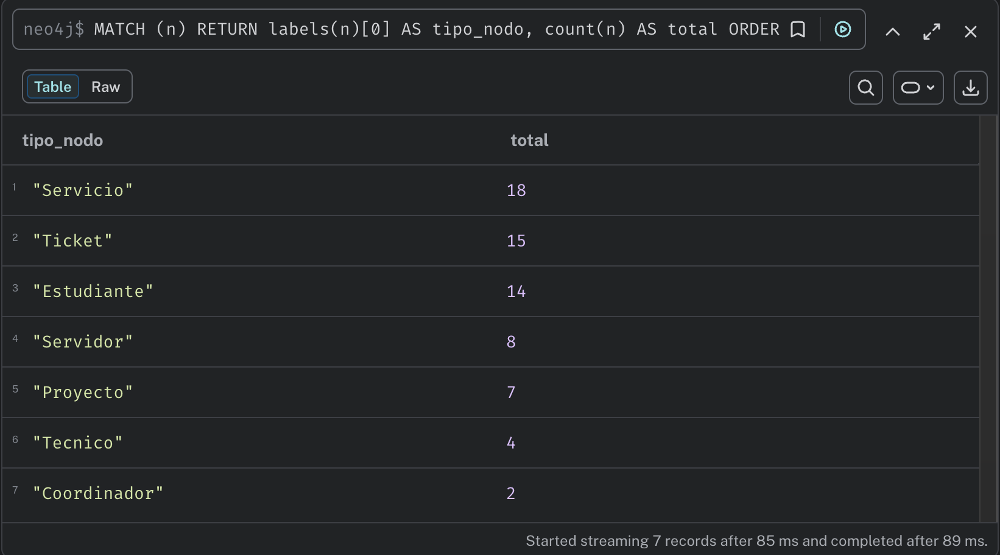

Contar relaciones por tipo

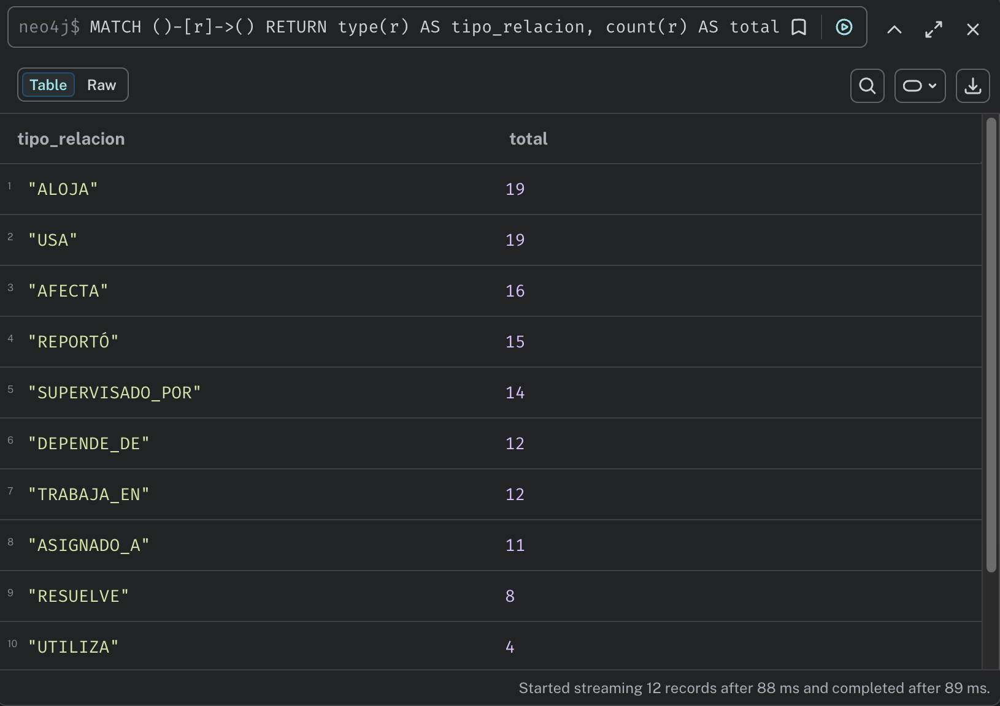

### Evidencias de la Operación 2

Mapa de dependencias de servicios

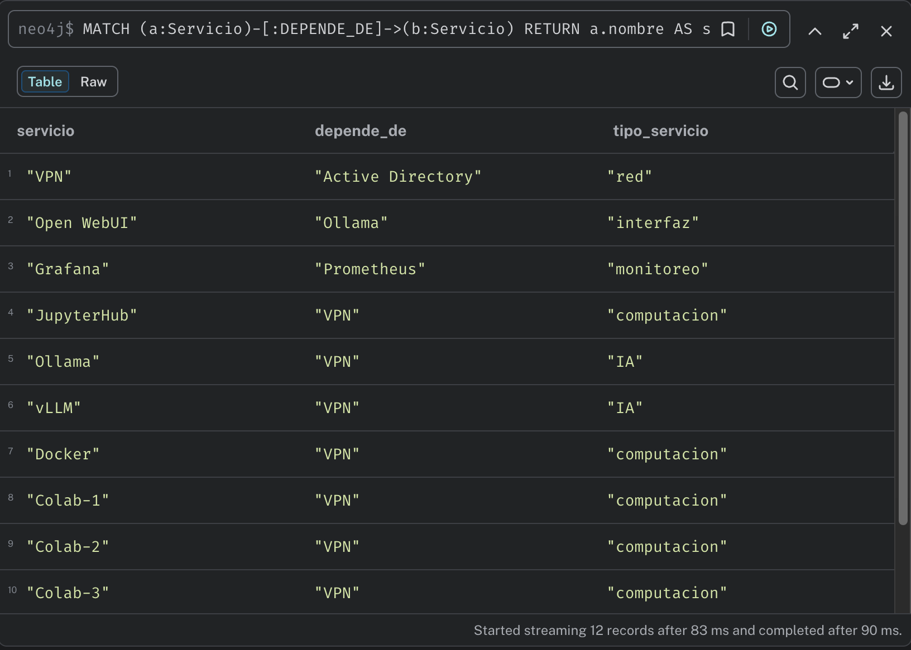

Cuál es el servicio más crítico?

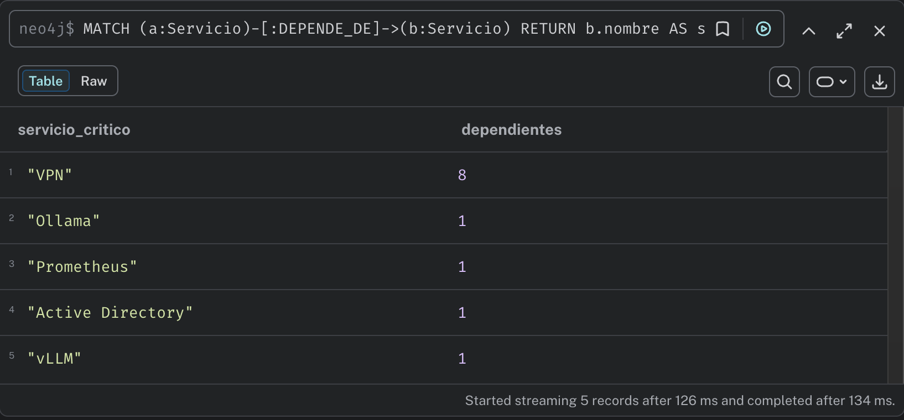

### Evidencias de la Operación 3

Tickets abiertos - estudiante, servicio y técnico

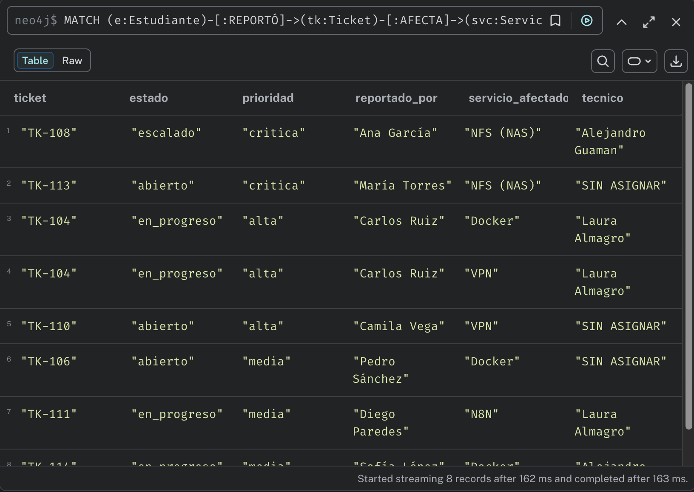

### Evidencias de la Operación 4

Actualización de un cierre de ticket

Antes de la actualización

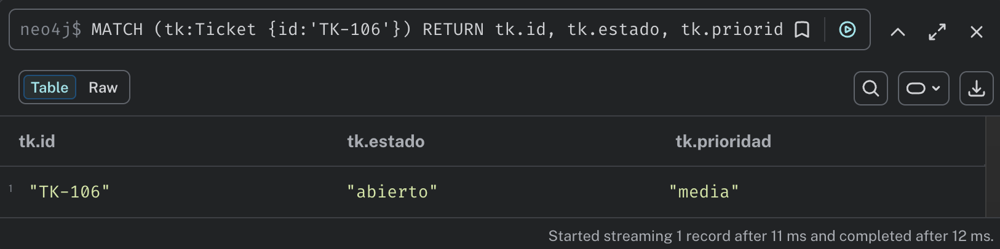

Después de la actualización

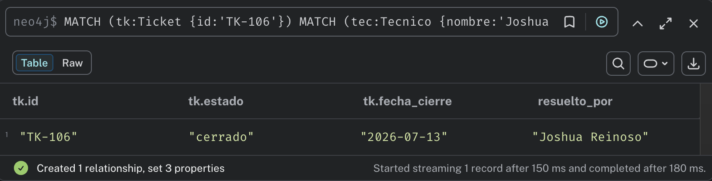

### Evidencias de la Operación 5

Análisis de impacto en cascada del servidor H200

Qué servicios aloja H200?

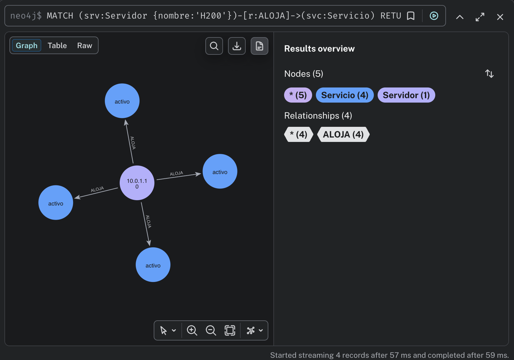

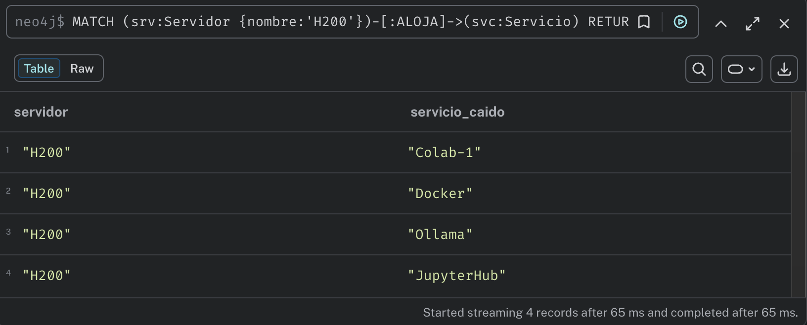

Qué otros servicios dependen de los caídos? (profundidad 1-3)

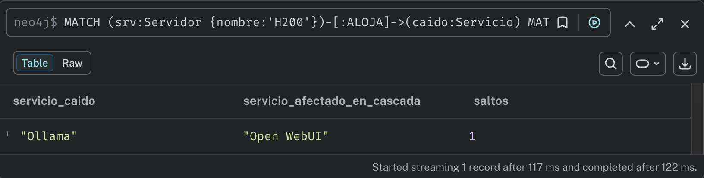

Qué proyectos usan esos servicios caídos?

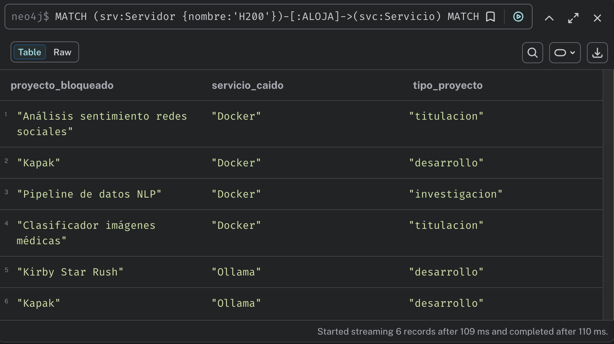

Qué estudiantes trabajan en esos proyectos y tienen tickets activos?

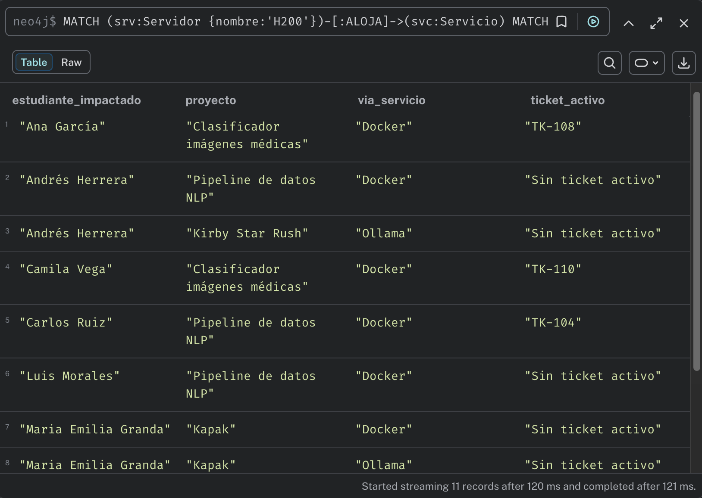

(MEGA-QUERY): Todo en una sola consulta de 5 saltos

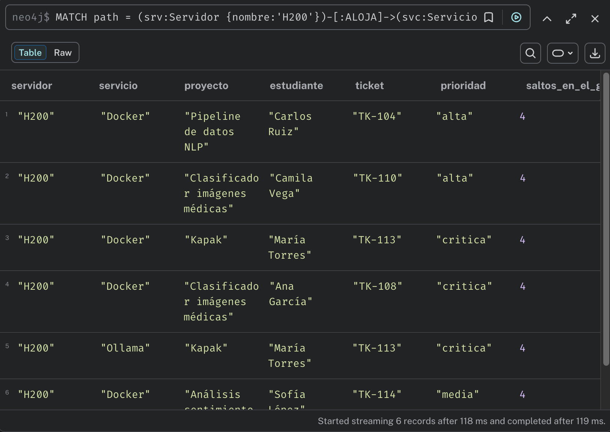

### Evidencias de la Operación 6

Estadísticas de resolución por técnico

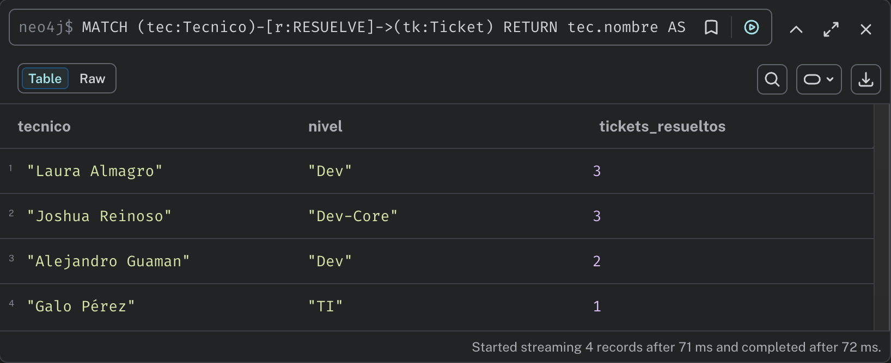

Técnicos con mayor carga de tickets activos asignados

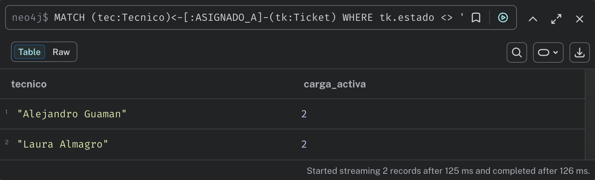
